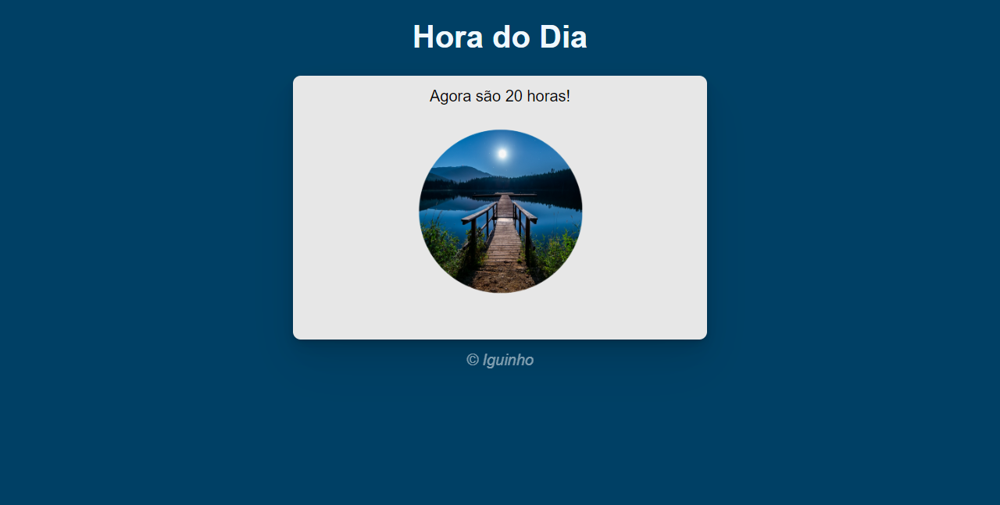

<h1 align="center">Dia, noite e Tarde</h1>

O repositório é capaz de capturar o horário atual com precisão, utilizando as informações fornecidas pelo sistema operacional ou outros meios confiáveis.  

  <a href="#-tecnologias">Tecnologias</a>&nbsp;&nbsp;&nbsp;|&nbsp;&nbsp;&nbsp;
  <a href="#memo-licença">Licença</a>

  

 

  

## :rocket: Tecnologias

Esse projeto foi desenvolvido com as seguintes tecnologias:

- HTML, CSS e JS
- Git, Github (actions, pages)
